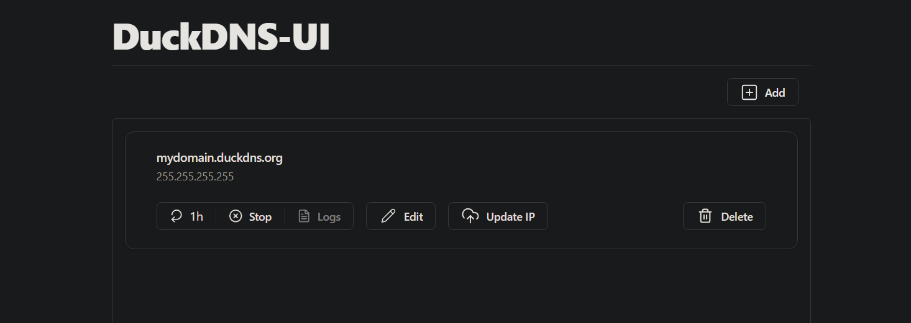

# duckdns-ui

Web ui for duckdns

## How to use



You can:

- Update ip manually
- Update ip w/ a periodic task
- View logs of tasks (WIP)
- Restore/migrate periodic tasks (WIP)

## Deploy

### From docker image

create `.env` and `compose.yaml` files

```
TOKEN={URDUCKDNSTOKEN}
```

```yaml
services:
  duckdns-ui:
    image: akorzunin/duckdns-ui:latest
    ports:
      - 3000:3000
    env_file:
      - .env
    volumes:
      - ./data:/src/data:rw
    restart: unless-stopped
```

Run

    docker-compose up -d

### From git repo

    git clone ...
    cp .env.example .env
    # setup TOKEN
    docker-compose up -d --build

## .env variables

- TOKEN - DuckDNS token
- LOG_JSON - 0/1, default 1 write log in JSON format
- DRY_RUN - 0/1, default 0 dont send request to duckdns server and generate fake ip each update

## Dev

### Generate client from openapi specs

    npx openapi-typescript-codegen --input ./docs/openapi.json --output ./web/src/api/client --client fetch

### Run vite dev sever

    cd web
    npm i
    echo "VITE_API_URL=http://localhost:3000" > .env
    npm run dev

### Run api w/ hot reload

    air

### Build docker containers

Create docker builder if its not exist

    docker buildx create --name mybuilder --bootstrap --use

Run build and update latest images

    docker buildx build --platform linux/amd64,linux/arm64,linux/arm/v7 -t akorzunin/duckdns-ui:latest --push .
